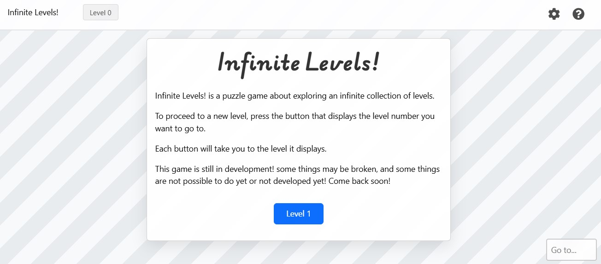
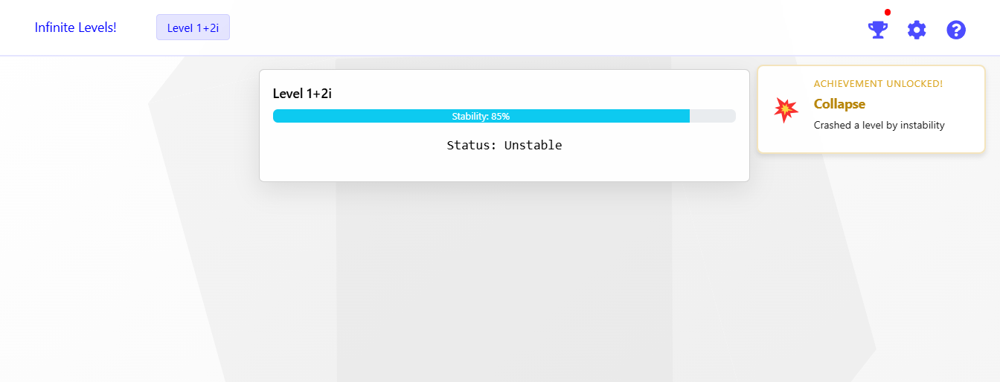
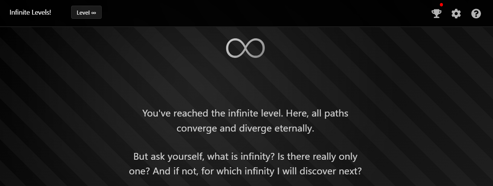

# 🌀 Infinite Levels

A mind-bending puzzle game that challenges you to explore an infinite collection of levels. The farther you progress, the more your understanding of numbers, mathematics, and infinity itself will be tested. 🤯

### Play Online
Visit [https://hamburgj.github.io/Infinite-Levels](https://hamburgj.github.io/Infinite-Levels) to play the latest version.

## 🎮 About the Game

Infinite Levels is a browser-based puzzle game built with React that challenges players to navigate through an endless series of levels using logic, mathematics, and creative thinking. Each level provides clues that help you discover how to reach new levels, but as you progress, the solutions become increasingly complex and mind-bending.

### ✨ Key Features

- **🔄 Infinite Progression**: True to its name, the game features an infinite number of levels to explore
- **💎 200+ Collectables**: Discover and gather items throughout your journey
- **🏆 50+ Achievements**: Complete special challenges to unlock achievements
- **🧩 Complex Puzzles**: From simple number sequences to complex mathematical concepts
- **🌐 No Installation Required**: Runs entirely in your browser

## 🔧 Technical Details

- Built with React and Redux for state management
- Fully client-side game with no backend requirements
- Responsive design that works across devices

## 🌟 Journey Through Reality

How far can you go? The game starts simple but quickly evolves into something more complex:

- Level 1: Learn the basics
- Level -7: Discover negatives
- Level 1+2i: Enter complex dimensions
- Level ∞: Transcend numerical boundaries
- Level ???: Play to find out

## 📸 Game Screenshots

## 🤝 Contributing

Found a bug or have a suggestion? Please open an issue!